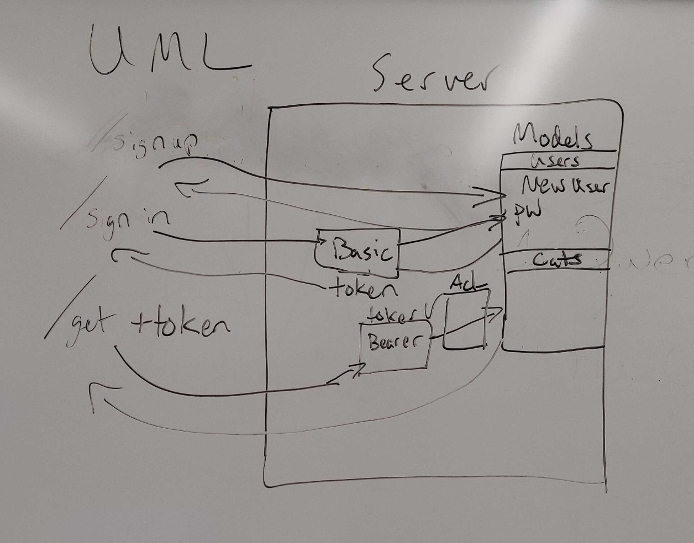
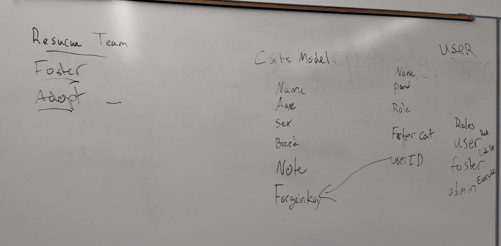
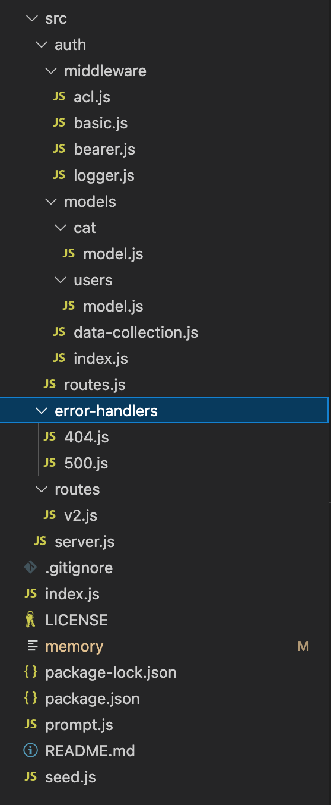

# RescueCats

## Deployed Site
[Deployed Site](https://rescuecats.onrender.com)

## Lab 9 - Auth Final Project

To test:
* First, npm install to install dependencies.
* Second, run node seed.js to populate the database with test cats.
* Third, start up the local server through npm start or nodemon start.
* Fourth, run node prompt.js to start a command line application that will run the demo.

## Contributors
* Joel Myrtil
* Daniel Yoon
* Trey Young

